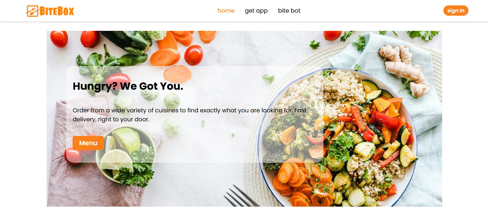

# Bite Box Food Delivery

This project is a single-page food delivery website built entirely with React.js. It allows users to browse through a variety of delicious dishes categorized for easy navigation. They can then add their favorite items to their cart, proceed to a secure checkout, and enjoy a delightful meal delivered straight to their doorstep (backend functionality not included in this project).

## Features: 
- 🔐 Seamless user authentication using Google Firebase
- 🍔 A wide range of food categories and items
- 🛒 Cart for adding food items
- 💳 Flawless checkout functionality and payment using Razorpay (test only)
- 🤖 AI chatbot assistant for recipes, culinary tips and more

## Technologies used:
- Vite - A fast development server and build tool for modern web applications.
- React JS -  A JavaScript library for building user interfaces.
- Tailwind CSS - A CSS framework for rapidly building modern websites.
- Firebase (used for authentication ) - Google's application development platform 
- Razorpay (test only) - A payment gateway that allows businesses to accept online payments.
- Gemini API - Official API of google gemini AI

## Installation:
1. Clone this repository :
``` bash
git clone https:https://github.com/MuneerHashmat/bite-box.git
```
2. Navigate to the folder: ``` cd bite-box ```
3. Install the dependencies: ``` npm install ```
4. Start development server: npm run dev

## Screenshots:

### 1. Home page
- **Header**


- **Menu section**


- **Food section**

